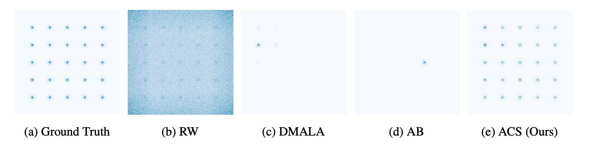

<h2 align="center"> <a href="https://www.arxiv.org/abs/2502.03685">[NeurIPS 2024] Gradient-based Discrete Sampling with Automatic Cyclical Scheduling</a></h2>
<div align="center">

[](https://www.arxiv.org/abs/2402.17699)
</div>


This is the codebase for the 2024 NeurIPS paper "Gradient-based Discrete Sampling with Automatic Cyclical Scheduling". In this code-base, we discuss the problem of multi-modal distributions within the context of gradient-based discrete samplers and propose a novel sampling algorithm, Automatic Cyclical Sampling (ACS), to avoid this pitfall. Below we show various samplers estimate of a highly multi-modal distribution to illustrate this point. 
<div style="display: flex; justify-content: space-around;">
  <figure style="margin: 10px;">
    
    <figcaption>Sampler Performance on Toy Multi-modal Example</figcaption>
  </figure>
</div>

## Organization 
This code base is built off of the Discrete Langevin Proposal code-base, which can be found at [this link](https://github.com/ruqizhang/discrete-langevin). 

The core sampler of interest is located in [samplers/acs_samplers.py](samplers/acs_samplers.py). Here we have the core tuning algorithm, along with the calculation of the step-size schedule and balancing-constant schedule. We also include the sampling step function, which is almost the same as in [samplers/dlp_samplers.py](samplers/dlp_samplers.py). 

The tuning algorithm within this class depends on several components from [samplers/tuning_components.py](samplers/tuning_components.py).

## Running Experiments
All the necessary bash scripts to run experiments are located in /bash_scripts. 
To run experiments, all that is needed is the following: 
```
bash bash_scripts/get_multi_modal_res.sh # Toy example
bash bash_scripts/rbm_sample_all.sh $CUDA_ID # RBM Sampling 
bash bash_scripts/ebm_sample_all.sh $CUDA_ID # EBM Sampling 
bash bash_scripts/ebm_sample_all.sh $CUDA_ID # EBM Sampling
bash bash_scripts/ebm_learn_all.sh $CUDA_ID # EBM Learning 
bash bash_scripts/ais_eval_all.sh $CUDA_ID # AIS Eval for learned EBMs
```

If there are any issues, send an email to ppynadat@purdue.edu. 

Below is the citation for our work: 
```
@misc{pynadath2024gradientbaseddiscretesamplingautomatic,
      title={Gradient-based Discrete Sampling with Automatic Cyclical Scheduling}, 
      author={Patrick Pynadath and Riddhiman Bhattacharya and Arun Hariharan and Ruqi Zhang},
      year={2024},
      eprint={2402.17699},
      archivePrefix={arXiv},
      primaryClass={cs.LG},
      url={https://arxiv.org/abs/2402.17699}, 
}
```